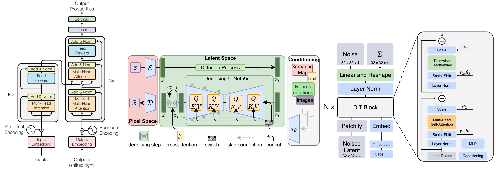

> **[IMPORTANT UPDATE] Due Updated:** Due of Lab 2(MLP) and Lab 3(SpMM) are changed to *next Friday(Feb 27th)*

> **[IMPORTANT UPDATE] Tables:** [[Paper Reading]](https://docs.google.com/spreadsheets/d/1Ngvq1AmHGQM9snaqJ-YnOpaBlbpE9lLnx7yZUrJPnEU/edit?usp=sharing) [[Course Presentation]](https://docs.google.com/spreadsheets/d/1A6mRKnstF_ZnnTlxThOGPJXnHrSnx1dldHg4RKAxhNk/edit?usp=sharing)

> **[IMPORTANT UPDATE] Project Repo:** [[Github]](https://github.com/Rice-Course-MLSys/COMP468-568-Experiments/)

Deep learning has become the computational engine powering modern AI—from large language models and generative diffusion transformers to vision-language multimodal systems. However, as models grow larger and workflows become more complex, traditional training and inference pipelines struggle to keep up. Efficient system design is critical for making deep learning scalable, cost-effective, and deployable in real-world environments.

This course provides a deep dive into the principles and practices of building high-performance deep learning systems. It explores the full stack of techniques—from low-level GPU kernel implementations to distributed training strategies and system-aware algorithm design—that enable state-of-the-art models to train faster and serve more efficiently. Students will engage with cutting-edge research and industry practices to understand how modern deep learning systems are optimized end-to-end.

---
**Topics include:**
- **High-Performance Kernel Design**: Custom CUDA kernels, memory hierarchy optimizations, operator fusion, I/O-aware compute scheduling, and leveraging compiler stacks such as TVM, Triton, and MLIR.

- **Distributed Training Systems**: Parallelism techniques (data, tensor, pipeline, sequence), memory-efficient training (ZeRO, activation checkpointing), and system-level tradeoffs for scaling to trillion-parameter models.

- **Optimized Inference Pipelines**: Serving systems such as TensorRT, vLLM, continuous batching, speculative decoding, KV-cache management, and deployment on heterogeneous hardware.

- **Model Compression & Acceleration**: Quantization, pruning, distillation, structured sparsity, and hardware-aware model transformation.

- **Systems for Generative Models**: Optimization of diffusion models, autoregressive video generation, multi-GPU serving for high-resolution outputs, and latency/throughput tradeoffs.

- **Reliability, Security, and Monitoring**: Fault-tolerant training, secure model execution, inference integrity, and system-level debugging and profiling tools.

This course is run as a project- and discussion-driven seminar. Students will analyze state-of-the-art papers, present research findings, and design their own system components through hands-on projects. The goal is to develop a holistic understanding of how deep learning workloads interact with hardware and software systems—and how to optimize them for modern scale.

Every few weeks, we will also host a guest lecture from leading researchers and practitioners in deep learning systems, offering firsthand insights into frontier challenges and innovations.

---

**Time:** *Wednesday, Friday* 12:30 PM - 01:45 PM CST

**Building:**  Herzstein Hall

**Room:**  AMP

**Start Date:** 01/12/2026

**End Date:** 04/24/2026

